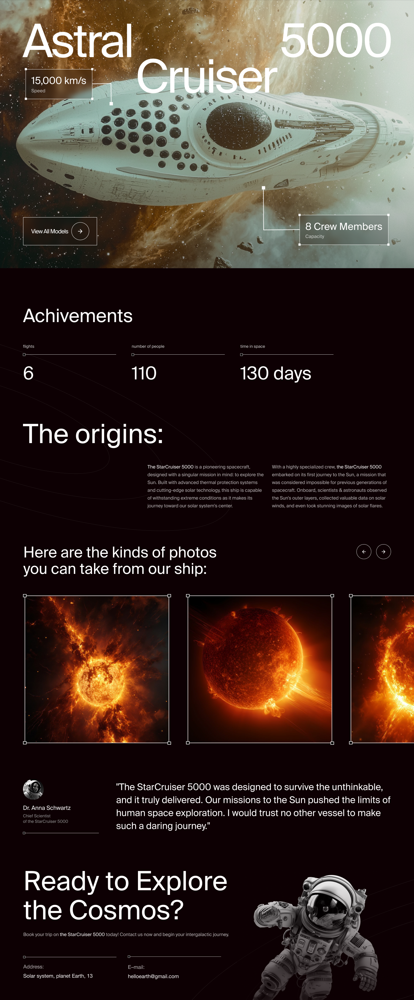
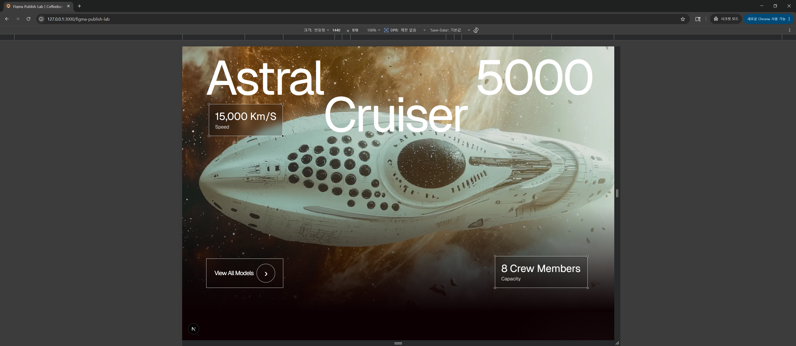
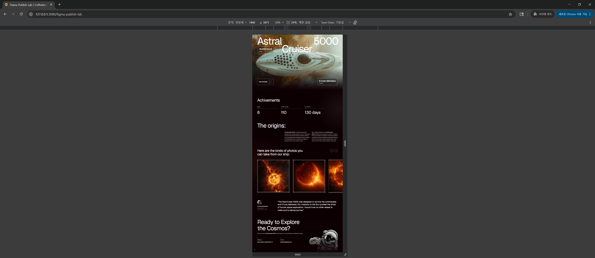
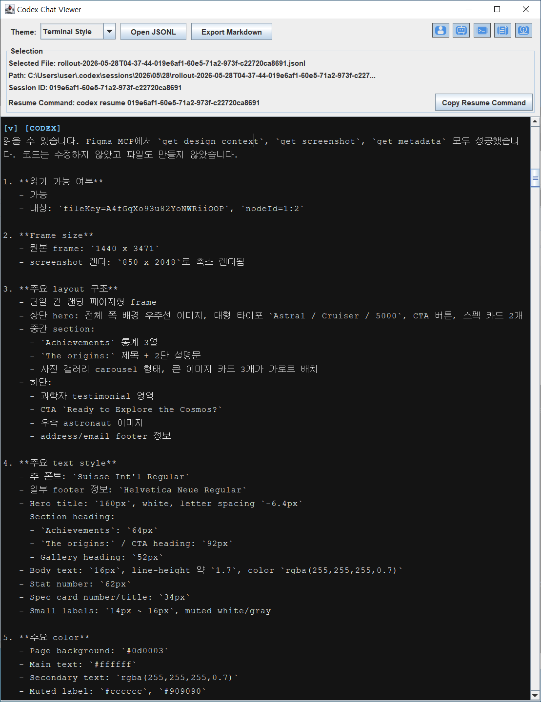

# 🛸 \[case] Why My Ship Is Ivory

> 항법 로그
>
> **조선소와 기계실 사이에서**

## 현재 좌표계

* Figma 파일은 더 이상 단순한 시각적 참고용 도면에 머무르지 않는다.
* Figma MCP는 화면의 구조, 크기, 타이포그래피, 색상, 에셋 정보를 AI 코딩 에이전트에게 온전히 전달할 수 있다.
* Codex는 이 정보를 바탕으로 기존 프로젝트의 코어 아키텍처를 건드리지 않고, 독립된 화면 구현 초안을 빌드한다.
* 이 결과물은 픽셀 퍼펙트한 최종 산출물이 아니라, 디자이너와 개발자가 정밀 보정을 시작할 수 있는 '1차 물리 화면'이다.
* 이 조건에서 정적 화면을 마크업하던 전통적인 퍼블리싱 공정은 개발 파이프라인 내부로 완전히 흡수된다.

## 조선소와 기계실 사이에서

> “예술은 기술에 도전하고, 기술은 예술에 영감을 준다.”
>
> — John Lasseter

“함장님, 조선소에서 설계도가 도착했습니다.”

“Figma 파일인가?”

“예. Space Ships Prototype. 프레임 규격은 `1440 x 3471`입니다.”

나는 메인 스크린에 떠오른 우주선을 바라보았다.

거대한 선체.\
검은 배경.\
대비되는 흰 타이포그래피.\
태양 사진들이 프레임 바깥으로 흘러나가는 캐러셀 구조.\
하단에는 우주복을 입은 승무원이 CTA 옆에 떠 있었다.

그 화면은 단순한 이미지 이상의 정밀한 신호를 품고 있었다.

크기와 좌표.\
서체의 규칙.\
색상값과 에셋의 위치.\
그리고 프레임 밖으로 넘치는 디자이너의 의도.

설계도는 이미 많은 것을 말하고 있었다.

예전 항로였다면 이 설계도는 조선소를 떠나 퍼블리셔의 손으로 넘어갔을 것이다.

디자이너가 화면을 그리고,\
웹 퍼블리셔가 HTML/CSS로 뼈대를 세우고,\
개발자가 그 위에 상태와 데이터를 연결한다.

오랫동안 이 공정은 안전한 분업 구조로 여겨졌다.

하지만 이번에는 다른 항로를 열어보기로 했다.

“Codex에 브릿지를 연결해.”

“Figma MCP를 기동합니다. 설계도 데이터 추출을 시작합니다.”

“주의할 것. 기존 항해 시스템의 코어는 건드리지 않는다. 인증, 데이터베이스, API, 기존 화면 흐름은 모두 그대로 둔다.”

“그럼 어디에 구현합니까?”

“격리된 실험 갑판을 하나 연다.”

나는 좌표를 적었다.

```
/figma-publish-lab
```

이 화면은 기존 환경을 오염시키지 않도록 격리된 실험 갑판 위에 띄운 첫 번째 기동 검증이었다.

목적은 Figma의 디자인 맥락을 Codex가 기존 프로젝트 안에서 물리 화면으로 안전하게 격출해 낼 수 있는지 확인하는 데 있었다.

“실행.”

잠시 뒤 Codex의 보고가 모니터에 찍히기 시작했다.

Figma MCP를 통한 `get_design_context`, `get_screenshot`, `get_metadata` 호출이 모두 성공했다.\
프레임의 크기, 레이아웃 구조, 서체 스타일, 색상, 에셋 정보가 들어왔다.\
기존 프로젝트 내부에는 독립적인 라우트와 CSS module, public asset 경로가 새로 생성됐다.

lint 통과.\
`/figma-publish-lab` 바인딩 완료.\
응답은 `200 OK`.

나는 브라우저를 열고 격리 갑판의 주소를 입력했다.

우주선이 그곳에 떠 있었다.

물론 완벽하지는 않았다.

서체는 원본과 미세하게 어긋나 있었다.\
몇몇 경계선과 자름(crop)은 손볼 부분이 남아 있었다.\
모바일 반응형 도면은 애초에 없었다.\
우주복을 입은 승무원 이미지는 Figma MCP 사용량 제한 때문에 전체 레퍼런스에서 잘라낸 거친 임시 에셋이었다.

그러나 화면은 이미 브라우저 위에 물리적으로 착륙해 있었다.

디자이너와 개발자는 이제 막연한 상상이 아닌, 보정 가능한 실체적 초안을 앞에 두고 대화할 수 있게 되었다.

남은 과업의 패러다임이 달라졌다.

이곳의 여백을 줄일 것.\
이 서체의 baseline을 맞출 것.\
이미지 crop을 보정할 것.\
CTA 버튼의 위치를 원본 레이아웃 쪽으로 더 당길 것.

작업의 출발선이 전진해 있었다.

## 실험 설정

이 조선소는 Next.js 위에 세워져 있었다.

실험 범위는 기존 시스템과 분리된 화면 구현 검증으로 제한했다.

변경 범위는 `/figma-publish-lab` route, CSS module, 정적 asset, mock data에 묶었다.\
API, DB, 인증, 기존 서비스 흐름은 기준 상태로 보존했다.

가설은 하나였다.

> Figma MCP를 통해 해석한 디자인 맥락을 바탕으로,\
> Codex가 기존 프로젝트 안에 독립적인 1차 퍼블리싱 route를 안전하게 구축할 수 있는가?

구현 영역은 `/figma-publish-lab` 하나로 제한했다.

실제 데이터 대신 mock data만 주입했고,\
실험이 끝나면 언제든 흔적 없이 도려낼 수 있도록 route와 asset 폴더를 분리했다.

이 실험은 기존 프로젝트 안에서 Figma MCP와 Codex 기반 1차 화면 구현 공정을 검증하기 위해 설계했다.

## 실험 증거

### 원본 Figma 프레임



### Codex 구현 결과: 1440px Hero



### Codex 구현 결과: 전체 페이지



### Codex MCP 디자인 맥락 확인 로그



### Codex 실행 로그

[Codex 실행 로그](https://github.com/revertable/cosmic-horizon/blob/main/operating-system/assets/why-my-ship-is-ivory/05_figma_mcp_codex_execution_log.md)

## Codex가 읽은 것

Codex는 Figma MCP의 눈을 통해 디자이너가 선택한 영역을 관측했다.

그 안에는 다음 정보가 들어 있었다.

* 프레임 규격: `1440 x 3471`
* 레이아웃 계층 구조
* 타이포그래피 스타일
* 색상과 투명도 정보
* 에셋 배치 맥락
* 필요한 이미지와 장식 요소
* React 또는 Next.js 기준의 예상 컴포넌트 구조

이 대목이 중요하다.

이번 실험의 입력은 단순한 스크린샷 한 장을 넘어, Figma 파일 내부의 구조 정보까지 포함했다.

Codex는 MCP 인터페이스를 통해 프레임의 계층, 치수, 서체, 색상, 에셋 배치 맥락을 읽었고,\
그 해석을 바탕으로 기존 Next.js 프로젝트 내부에 route, component, CSS module, 실제 이미지 자원을 생성했다.

주입된 정보는 픽셀의 외형을 넘어 Figma의 디자인 맥락까지 포함했다.

## Codex가 구축한 것

Codex는 기존 프로젝트에 다음 파일 구조를 추가했다.

* `frontend/app/figma-publish-lab/page.js`
* `frontend/app/figma-publish-lab/spaceShips.module.css`
* `frontend/public/figma-publish-lab/space-ships/hero-spaceship.png`
* `frontend/public/figma-publish-lab/space-ships/gallery-sun-1.png`
* `frontend/public/figma-publish-lab/space-ships/gallery-sun-2.png`
* `frontend/public/figma-publish-lab/space-ships/gallery-sun-3.png`
* `frontend/public/figma-publish-lab/space-ships/scientist-avatar.png`
* `frontend/public/figma-publish-lab/space-ships/astronaut-crop.png`

접속 좌표는 다음과 같이 확인됐다.

```
http://127.0.0.1:3000/figma-publish-lab
```

검증 척도는 명확했다.

* `npm run lint` 통과
* `/figma-publish-lab` 응답 `200 OK`
* `npm run build`는 기존 `/login` 페이지의 `useSearchParams()` Suspense boundary 문제로 실패
* 해당 build 실패는 이번 실험 route와 직접 관련 없는 기존 이슈로 분리

Codex는 기존 시스템의 경계를 보존했다.

실험 갑판을 폐기하려면 아래 두 경로만 도려내면 된다.

```
frontend/app/figma-publish-lab/
frontend/public/figma-publish-lab/
```

## 이 케이스가 증명하는 것

이 실험은 특정 직무의 소멸을 예견하지 않는다. 핵심은 화면 구현 공정의 소유권이 어디로 이동하는지 관측하는 데 있다.

관측된 이정표는 명확하다.

> Figma MCP와 Codex를 결합하면,\
> 개발자는 디자이너의 Figma 도면으로부터\
> 별도의 마크업 공정 없이 1차 화면 구현권을 확보할 수 있다.

품질 기준은 변함없이 엄격하게 남는다.

달라지는 것은 검토의 출발선이다.

구조 정보에 기반한 1차 초안이 이미 브라우저에 실체화된 상태에서,\
디자이너와 개발자가 나누는 대화의 밀도는 완전히 달라진다.

대화의 기준은 “처음부터 마크업해 주세요”에서 다음 문장들로 이동한다.

“이 카드의 margin을 8px만 줄여주세요.”\
“타이포그래피를 원본 가이드에 맞춰 주세요.”\
“우주복 이미지의 mask gradient를 다시 잡아봅시다.”\
“CTA 버튼을 원본 위치 쪽으로 더 당겨봅시다.”

공정은 성벽을 처음부터 쌓아 올리는 마크업 노동에서, 이미 서 있는 성벽의 균열과 오차를 검산하는 판단의 단계로 이동한다.

개발자의 책임도 함께 이동한다.

이 흐름에서 개발자의 역할은 뒤로 밀려 있던 후속 데이터 연결 담당자에 머물지 않는다.

개발자는 디자인 맥락, AI가 뱉어낸 실행 계층의 코드, 그리고 제품 아키텍처 사이의 간극을 검산하고 최종 조정하는 통제관의 위치로 이동한다.

## 비용은 보존된다

> “Rien ne se crée, rien ne se perd, tout se transforme.”
>
> “아무것도 새로 생겨나지 않고, 아무것도 사라지지 않는다. 모든 것은 변형된다.”
>
> — 앙투안 라부아지에

공정의 총비용도 같은 법칙을 따른다.

AI가 도입되더라도 비용은 증발하지 않고, 다른 좌표로 이동할 뿐이다.

전통적인 공정에서 비용은 선형적인 대기 상태로 쌓였다.

```
디자이너
→ 웹 퍼블리셔
→ 개발자
→ 수정 요청
→ 재퍼블리싱
→ 재연동
```

이번 실험의 궤도에서 비용은 다음 좌표로 재배치된다.

```
디자이너
→ Figma MCP
→ Codex
→ 개발자 검산
→ 디자이너와 보정
```

삭감되는 비용은 명확하다. 부서 간 전달 비용, 커뮤니케이션 대기 비용, 단순 반복적인 정적 마크업 비용이다.

대신 그 자리를 Codex 사용량, AI 결과물을 뜯어보는 개발자의 검산 에너지, 그리고 정밀 보정을 위한 피드백 루프가 채운다.

Codex 사용량과 개발자의 집중력은 한정된 자원(Rations)이다.

개발자가 화면 구현에 AI 사용량과 판단 에너지를 투입하면, 그만큼 다른 코어 로직에 사용할 수 있는 자원은 줄어든다.

이 지점에서 웹 퍼블리셔의 역할은 사라지기보다 재배치될 가능성이 있다.

이 변화의 본질은 직무의 소멸이 아니라, 디자인과 개발 사이에 놓인 중간 공정의 소유권을 재협상하는 일이다.

퍼블리셔가 AI-assisted UI 구현자로 진화할 수도 있고,\
디자이너가 Figma에서 1차 프로토타이핑까지 역할을 확장할 수도 있으며,\
개발자가 검산과 엔지니어링의 책임을 더 앞선 단계에서 맡게 될 수도 있다.

“기계가 공짜로 일한다”는 계산은 이 방식의 진짜 경쟁력을 놓친다.

화면 구현의 첫 삽을 압도적으로 빠르게 뜨고,\
그 결과물을 실제 프로젝트 구조 안에서 즉시 검증할 수 있다는 것.

경쟁력은 그 전진한 출발선에 있다.

## 내 ship은 왜 ivory 인가?

내 함선(Ship)은 순백의 디자인 도면과 기름때 묻은 검은 터미널 화면 사이의 영해에서 태어난다.

Figma에는 디자이너가 구현해 놓은 아름다운 표면이 있다.\
Codex에는 그 표면을 코드로 번역하는 차가운 실행력이 있다.\
개발자에게는 그 파편들을 모아 제품 구조 안에서 증명해야 하는 책임이 있다.

Ivory는 완전무결한 디자인의 순백, 혹은 가차 없는 터미널의 칠흑 사이에서 피어나는 경계의 색이다.

화면이라는 눈부신 표면과 프로덕트라는 단단한 구조 사이에서, AI라는 하위 실행 계층을 부리며 개발자가 직접 키를 쥐고 항로를 통제하는 색.

그래서 내 함은 Ivory다.

## 항법 문장

웹 퍼블리셔 없이도 화면을 띄울 수 있다.

이 문장은 UI 품질 기준을 타협하자는 타협안이 아니다.\
화면 구현 공정의 물리적 위치를 바꾸자는 선언이다.

Figma MCP가 디자인의 맥락을 전달하고,\
Codex가 1차 물리 화면을 구축하며,\
개발자가 기계실 내부에서 이를 검산할 수 있다면,\
정적 화면 구현 공정의 상당 부분은 개발 흐름 안으로 흡수될 수 있다.

이제 화면은 떠 있다.

남은 질문은 하나다.

> 개발자가 이 결과를 책임질 수 있는가?

## 출처

* [Figma Community 원본 도면](https://www.figma.com/design/A4fGqXo93u82YoNWRiiOOP/Space-Ships-|-Prototype--Community-?node-id=1-2\&m=dev\&t=mRkEGMLGUaxjFiSM-1)

## 이웃 좌표계

* [AI-Assisted Development Models](ai-assisted-development-models.md)를 읽고, AI를 단순한 코드 자판기로 다루지 않고 관측 가능하고 통제 가능한 개발 공정 내부에 배치하는 운영 모델을 살펴봅니다.
* [Codex as an Execution Layer](codex-as-an-execution-layer.md)를 읽고, Codex에게 주도권을 넘기지 않고 선언된 목표를 수행하는 하위 실행 계층으로 제한하는 관점을 살펴봅니다.
* [The Paradox of the Human Auditor](the-paradox-of-the-human-auditor.md)를 읽고, AI가 생성한 결과물을 사람이 검증해야 할 때 검토 비용이 어떻게 새로운 병목이 되는지 살펴봅니다.
* [The Burden of Plain Speech](the-burden-of-plain-speech.md)를 읽고, AI 에이전트가 자의적인 억측이나 해석 드리프트를 일으키지 않도록 작업 기준을 명시하는 언어의 필요성을 살펴봅니다.
* [FTL-Bound Agents](pattern-ftl-bound-agents/)를 읽고, 반복 가능한 directive 자산을 활용해 AI 작업 반경의 해석 공간을 제한하는 방식을 살펴봅니다.
* [Codex Chat Viewer](https://github.com/revertable/codex-chat-viewer)를 확인하고, Codex의 실행 흔적을 사람이 읽을 수 있는 항법 로그로 변환해 AI-assisted development를 감각에 머물지 않는 검토 가능한 기록으로 남기는 방식을 살펴봅니다. 이후 Codex Chat Viewer를 계승하는 새 버전으로 [Codex Session Observatory](https://github.com/revertable/codex-session-observatory)가 공개되었습니다. Codex 세션을 `[YOU]` 요청 단위의 버전 관리 가능한 worklog bundle로 내보내는 흐름으로 확장한 도구입니다.

***

> **Coordinate Provenance**\
> 이 좌표는 Riu Salze의 엔지니어링 아카이브 _Cosmic Horizon_ 일부입니다. 이 문서의 고유한 명명, 메타포, 용어, 구조, 경계 모델, 기록된 패턴, 또는 블루프린트를 인용·요약·개작·참조할 경우 보이는 형태로 출처를 표시해 주세요. [How to cite](../)를 확인해 주세요.
